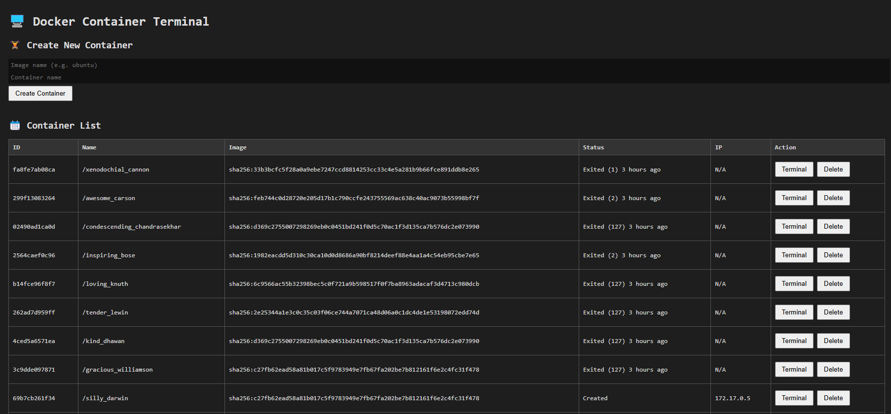
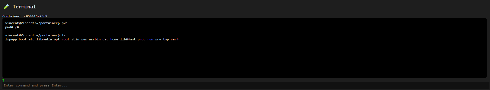

# 🐳 Portainer-like Backend Service

This project is a lightweight backend written in **TypeScript** and **Node.js (ESM)** for managing Docker containers (similar to Portainer). It provides APIs to list, create, execute commands inside, and delete containers.

---

## 📦 Prerequisites

- Node.js v18 or higher
- Docker Engine
- Yarn (optional but recommended)

---

## 🚀 Development

To start the project in development mode (with auto-reload if using `nodemon`):

```bash
yarn dev



